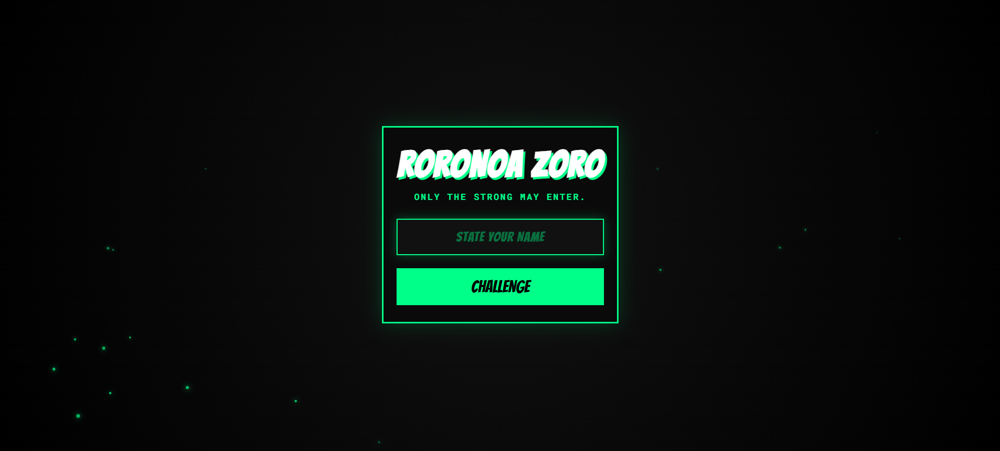

Below is a **complete, copy-paste ready `README.md`** with badges, clean sections, and a clear **How to Test** section.
It is written to look professional for GitHub, jams, and recruiters.

---

````md
<p align="center">
  
</p>

<h1 align="center">⚔️ ZORO</h1>
<p align="center">
  <b>A Lore-Accurate Borked UI Experience</b>
</p>

<p align="center">
  <a href="https://broked-ui.vercel.app/" target="_blank">
    
  </a>
  
  
  
</p>

---

## 🧠 Concept

**ZORO** is a web project built for the **Borked UI Jam**, where interfaces are intentionally broken or confusing.

Instead of fake bugs or glitchy buttons, this project takes the theme literally:  
👉 **The user interface is physically destroyed.**

When the user interacts with the dialog box, **Roronoa Zoro (One Piece)** appears and slices the UI into pieces using his **Santoryu (Three Sword Style)**.

---

## 🎮 How It Works

1. The site presents a dramatic challenge screen  
2. The user enters their name  
3. Clicking **CHALLENGE** triggers:
   - Screen darkening (Haki pressure)
   - Zoro voice line
   - High-speed dash animation
   - Dialog box sliced into 4 animated pieces
4. The UI resets after the attack

---

## ✨ Features

### 🧭 Lore-Accurate “Lost” Mechanic

- Every click has a **10% RNG chance** to fail
- Zoro enters from the wrong direction
- The UI remains intact
- Text changes to: **“HUH? HE GOT LOST…”**

💡 Can be forced by typing **`lost`** as the input.

---

### 🥚 Easter Eggs (Try These Names)

| Input Name | Result |
|----------|--------|
| `Sanji` / `Cook` | Instant rage, no delay |
| `Kuina` | Zoro refuses to cut |
| `Mihawk` | Attack cancelled — “Not ready yet” |

---

### 🎨 Visual & Audio Polish

- Green **Haki cursor trail**
- Dynamic dark mode on attack
- Chromatic glitch effect on impact
- Frame-accurate sword slash audio

---

## 🛠️ Tech Stack

- **HTML5**
- **CSS3**
- **Vanilla JavaScript**
- No frameworks
- No libraries

---

## ⚙️ How the Slice Effect Works

- The dialog box is cloned into **4 identical elements**
- Each clone uses a unique `clip-path` polygon (one quadrant)
- Pieces are animated using `transform: translate + rotate`
- Positions are calculated dynamically for full responsiveness

---

## 🧪 How to Test

### ▶️ Online (Recommended)

Open the live demo:

🔗 **https://broked-ui.vercel.app/**

**Test checklist:**
- Enter a random name → normal slice
- Enter `lost` → Zoro misses
- Try `Sanji`, `Kuina`, `Mihawk`
- Test on mobile & desktop
- Rapidly click CHALLENGE to verify reset stability

---

### 💻 Run Locally

```bash
git clone https://github.com/your-username/zoro-borked-ui.git
cd zoro-borked-ui
````

Then simply open:

```bash
index.html
```

No build step. No dependencies.

---

## 📂 Assets

* **Character:** Roronoa Zoro (*One Piece*)
* **Cursor:** Custom Shusui sword sprite
* **Audio:** Anime SFX (voice, slash, sheath)

⚠️ Assets are used for **non-commercial / fan / jam purposes only**.

---

## 🚀 Status

✅ Complete
✅ Polished
✅ Jam-Ready
✅ Deployed on Vercel

---

## 🧩 Inspiration

> “If the UI is broken… why not let Zoro break it?”

---

## 📜 License

This project is for **educational and jam submission purposes**.
No commercial use intended.

---

